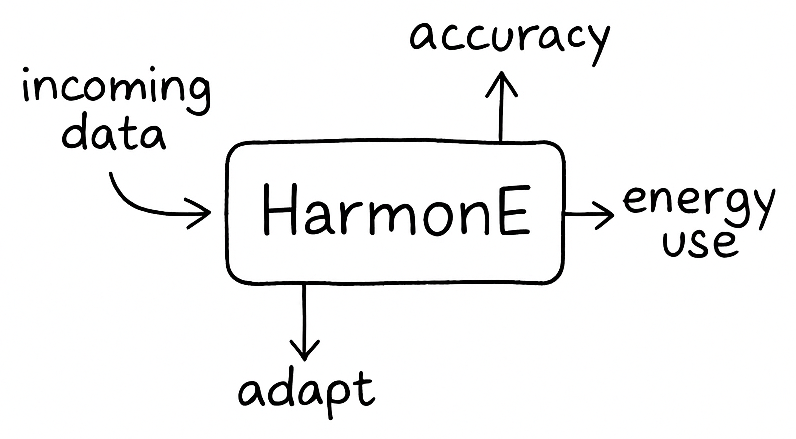
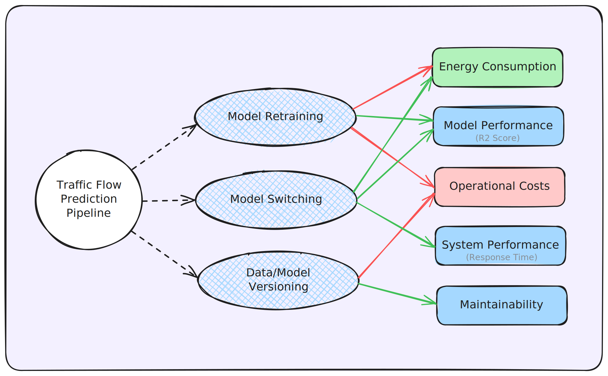
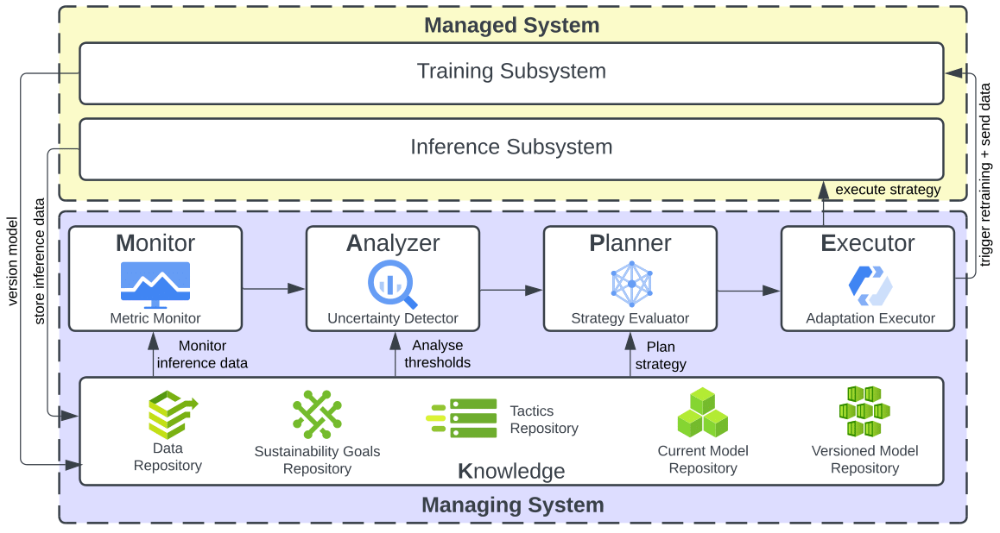

## Abstract



Machine learning powers much of what we use every day, but keeping the models that these systems use reliable and energy-efficient over time isn’t easy. Models drift, data changes, and retraining too often can drain resources. Retraining models too often wastes energy and resources, while doing too little can hurt performance.

**HarmonE** is our solution: an architectural approach that helps machine learning pipelines adapt on their own. It monitors accuracy, energy use, and data shifts to keep things running smoothly. It only takes action when needed, based on sustainability goals set in advance.

We tested HarmonE on a city’s traffic system using a digital twin. It adapted to new conditions while saving energy and maintaining performance. After all, sustainability isn’t just about quick fixes; it’s about building systems that can maintain their performance over time, even as conditions evolve. 

---

## Motivation

Today’s MLOps pipelines often focus on performance but overlook long-term sustainability. Frequent retraining maintains accuracy but is resource-intensive.

HarmonE adds awareness and adaptability. It helps models stay efficient and accurate without wasting energy or compute.

---

## Background & Prior Work

HarmonE unifies insights from four earlier studies that each tackled sustainability from a different angle.

<!-- <style>
  table {
    table-layout: auto;
    width: 100%;
    border-collapse: collapse;
  }
  th, td {
    white-space: normal;
    word-wrap: break-word;
    vertical-align: top;
    padding: 0.75rem;
    border-bottom: 1px solid #ddd;
  }
</style> -->

<table>
  <thead>
    <tr>
      <th>Prior Work</th>
      <th>Key Idea</th>
      <th>Link</th>
    </tr>
  </thead>
  <tbody>
    <tr>
      <td>
        <em>Towards Architecting Sustainable MLOps</em><br>
        <small>ICSA 2024</small>
      </td>
      <td>Early sketch of combining runtime monitoring with energy‑accuracy trade‑offs.</td>
      <td><a class="button-purple" href="https://arxiv.org/pdf/2404.04572" target="_blank">Read&nbsp;Poster</a></td>
    </tr>
    <tr>
      <td>
        <em>EcoMLS</em><br>
        <small>GREENS-ICSA 2024</small>
      </td>
      <td>Design‑time energy & accuracy budgets that trigger condition‑based adaptation.</td>
      <td><a class="button-purple" href="https://arxiv.org/pdf/2404.11411" target="_blank">Read&nbsp;EcoMLS</a></td>
    </tr>
    <tr>
      <td>
        <em>SWITCH</em><br>
        <small>SEAMS 2024</small>
      </td>
      <td>Lightweight runtime switching among pre‑trained models for rapid response.</td>
      <td><a class="button-purple" href="https://arxiv.org/pdf/2402.06351" target="_blank">Read&nbsp;SWITCH</a></td>
    </tr>
    <tr>
      <td>
        <em>Digital Twin for ITS</em><br>
        <small>AEDT-ICSA 2025</small>
      </td>
      <td>City‑scale Digital Twin that provides traceable metrics for adaptive evaluation.</td>
      <td><a class="button-purple" href="https://arxiv.org/pdf/2502.17646" target="_blank">Read&nbsp;DT&nbsp;Paper</a></td>
    </tr>
  </tbody>
</table>


These works shaped HarmonE’s Decision Map, adaptive tactics, and evaluation testbed.

---

## What is HarmonE?

HarmonE is a self-adaptive MLOps architecture built around the MAPE-K loop:

- **Monitor**: Tracks accuracy, energy use, and data changes.
- **Analyze**: Detects when things drift from expected behavior.
- **Plan**: Determines the best course of action.
- **Execute**: Applies the adaptation.
- **Knowledge**: Stores history and goals to guide decisions.

You define sustainability goals like energy limits or minimum accuracy, and HarmonE helps the system meet them.

---

## Key Components

HarmonE is composed of three main parts:

- **Decision Map**: Sets design-time sustainability goals and constraints.



- **Managed System**: The ML pipeline for training and inference.
- **Managing System**: The MAPE-K loop that drives adaptation.




---

## Evaluation: Traffic Prediction Case Study

We tested HarmonE on a digital twin of a city traffic system using the PeMS dataset. Compared with traditional setups, HarmonE:

- Used 54.5% less energy than retraining-based approaches.
- Achieved 95% of the best model’s accuracy.
- Reduced inference time by over 50%.

| Approach      | Energy (mJ) | R² Score | Inference Time (ms) | # Adaptations |
|---------------|-------------|----------|----------------------|----------------|
| LR            | 12.12       | 0.7597   | 0.83                 | -              |
| LR + PRT      | 12.70       | 0.7624   | 0.83                 | 4              |
| SVM           | 14.76       | 0.7897   | 1.11                 | -              |
| SVM + PRT     | 16.33       | 0.8167   | 1.11                 | 4              |
| LSTM          | 32.91       | 0.9005   | 3.85                 | -              |
| LSTM + PRT    | 45.35       | 0.9085   | 3.85                 | 4              |
| Switch        | 24.32       | 0.8445   | 2.27                 | 13             |
| Switch + PRT  | 25.32       | 0.8435   | 2.27                 | 17             |
| **HarmonE**   | **20.62**   | **0.8628** | **1.89**           | **12**         |

---

## Why HarmonE Matters

HarmonE demonstrates that machine learning systems can be both effective and sustainable. Instead of retraining on a fixed schedule, it adapts only when needed. This reduces energy use, preserves performance, and supports long-term reliability.

---

## Citation

```bibtex
@misc{bhatt2025harmoneselfadaptiveapproacharchitecting,
  title={HarmonE: A Self-Adaptive Approach to Architecting Sustainable MLOps},
  author={Hiya Bhatt and Shaunak Biswas and Srinivasan Rakhunathan and Karthik Vaidhyanathan},
  year={2025},
  eprint={2505.13693},
  archivePrefix={arXiv},
  primaryClass={cs.SE},
  url={https://arxiv.org/abs/2505.13693},
}
```
---
<div style="display: flex; justify-content: space-between; align-items: center; margin-top: 3rem; padding: 0 5%;">
  
  
  
</div>

